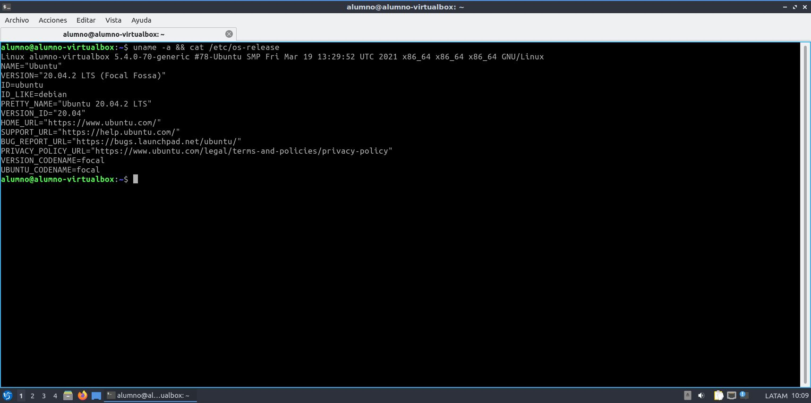
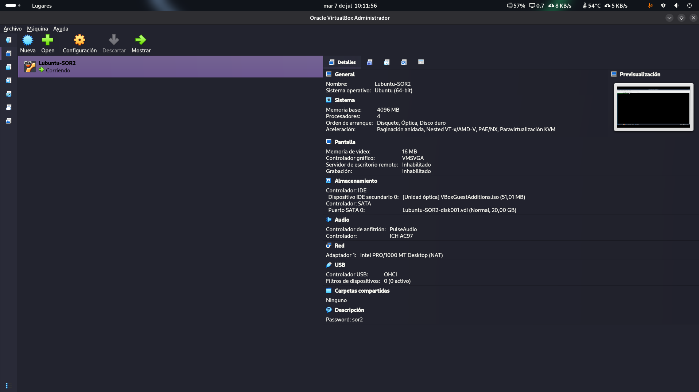
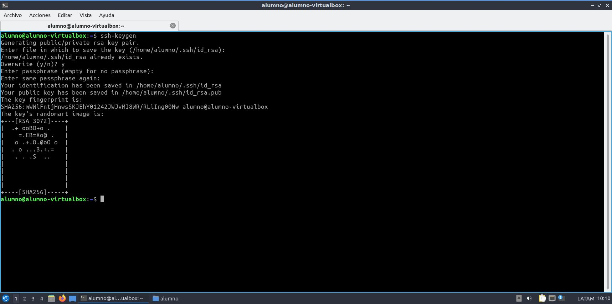

# TP4 — PROTOCOLOS Y SEGURIDAD EN REDES SOR2 2S 2026 Intensivo
## Universidad Nacional de General Sarmiento
## Licenciatura en Sistemas
## Sistemas Operativos y Redes 2 (A0533)
### Año y semestre: 
Intensivo Invierno 2026
### Profesor: 
- Benjamín Chuquimango
### Integrantes: 
- David Ezequiel Cañete 
- Ignacio Mariano Tula


# Índice
@todo


# SECCIÓN 1 — Introducción (½ página)

## 1.1 Contexto y objetivo del trabajo
@todo
## 1.2 Distribución de tareas entre integrantes
@todo

Tabla de distribución:
|*Integrante* | *Tarea a Cargo* |
| ------------- | ------------- |
| David Cañete | @todo | 
| Ignacio Tula | @todo | 


# SECCIÓN 2 — Entorno de Trabajo

## 2.1 Sistema operativo (salida de uname -a y cat /etc/os-release)




## 2.2 Recursos de la VM (RAM, disco, CPU asignados)

## 2.3 Herramientas utilizadas (nombre y versión de cada herramienta relevante)

### 2.3.1 Preparación de la VM para escrbir en repo


## 2.4 Estado inicial del sistema (capturas del estado "antes" según lo indicado en el enunciado de
cada TP)

# SECCIÓN 3 - Seguridad en HTTPS, Certificados y Autoridad Certificante

## 3.1 Primera Parte: Instalación de Servidor LAMP

### 3.1.2 Instalación de apache

Se instaló el servidor web Apache con
```bash
sudo apt-get install apache2 -y > archivo.txt
```

