# TP4 — PROTOCOLOS Y SEGURIDAD EN REDES SOR2 2S 2026 Intensivo
## Universidad Nacional de General Sarmiento
## Licenciatura en Sistemas
## Sistemas Operativos y Redes 2 (A0533)
### Año y semestre: 
Intensivo Invierno 2026
### Profesor: 
- Benjamín Chuquimango
### Integrantes: 
- David Ezequiel Cañete 
- Ignacio Mariano Tula


# Índice
@todo


# SECCIÓN 1 — Introducción (½ página)

## 1.1 Contexto y objetivo del trabajo
@todo
## 1.2 Distribución de tareas entre integrantes
@todo

Tabla de distribución:
|*Integrante* | *Tarea a Cargo* |
| ------------- | ------------- |
| David Cañete | @todo | 
| Ignacio Tula | @todo | 


# SECCIÓN 2 — Entorno de Trabajo

## 2.1 Sistema operativo (salida de uname -a y cat /etc/os-release)


## 2.2 Recursos de la VM (RAM, disco, CPU asignados)

## 2.3 Herramientas utilizadas (nombre y versión de cada herramienta relevante)

### 2.3.1 Preparación de la VM para escrbir en repo
Creamos un juego de clave privada y pública SSH para poder iniciar sesión usando dicho protocolo en el repositorio GIT del presente trabajo. 

Con la finalidad de facilitar la sincronización de los archivos de captura de pantalla o de grabación de la entrada/salida de la terminal

```bash
ssh keygen
```


### 2.3.2 Configuración de /etc/hosts
En el apartado 3 en adelante, se nos solicita crear virtual host en Apache para dominios `empresa1.com` y `empresa2.com`. Sin embargo, la resolución de nombres terminará apuntando a estos sitios en internet. Por lo tanto necesitamos forzar a la máquina virtual a que apunte dichos nombres DNS al propio `localhost`, con la finalidad de que el navegador apunte las solicitudes web a nuestro servidor Apache.


```bash
cat /etc/hosts
echo "127.0.0.1    empresa1.com" | sudo tee -a /etc/hosts
echo "127.0.0.1    empresa2.com" | sudo tee -a /etc/hosts
echo "127.0.0.1    secure-example.com" | sudo tee -a /etc/hosts
ping -c 4 empresa1.com
```

Con estos comandos, asignamos que los nombres `empresa1.com` y `empresa2.com` resuelvan a `localhost` (`127.0.0.1`), evitando que salgan a resolverse a un servidor DNS de un proveedor de internet.

Con el ping, simplemente verificamos que al preguntar por `empresa1.com` efectivamente responde nuestra propia máquina virtual local, y no un servidor remoto en internet.

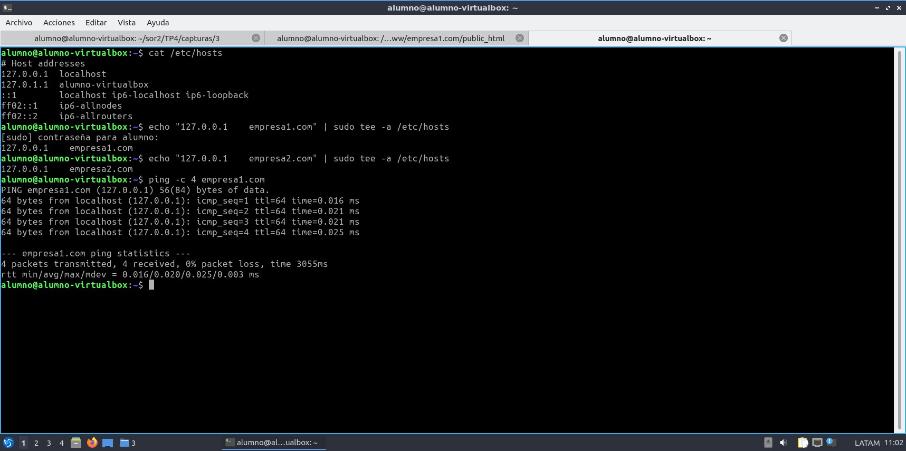


## 2.4 Estado inicial del sistema 

(capturas del estado "antes" según lo indicado en el enunciado de
cada TP)

# SECCIÓN 3 - Seguridad en HTTPS, Certificados y Autoridad Certificante

## 3.1 Primera Parte: Instalación de Servidor LAMP

### 3.1.1 Instalación de apache

Se instaló el servidor web Apache con
```bash
sudo apt-get install apache2 -y > archivo.txt
```

[Salida de Instalación de Apache](capturas/3/3-1-1.txt)


### 3.1.2 Configuración general de Apache

Se revisó el contenido de los archivos de configuración

- `/etc/apache/apache2.conf` 
- `/etc/apache/ports.conf` 

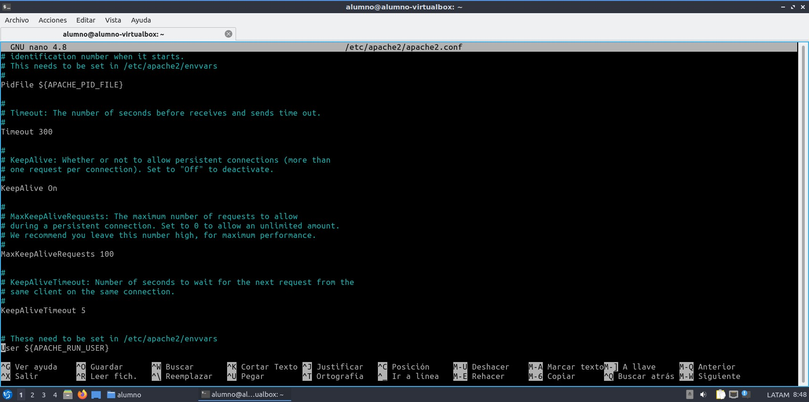
Contenido de: [apache2.conf](capturas/3/apache2.conf)

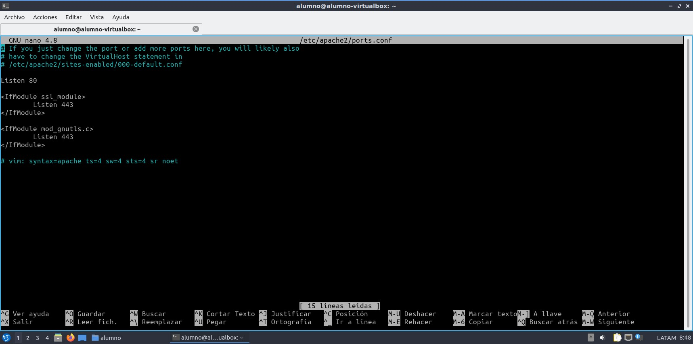
Contenido de: [ports.conf](capturas/3/ports.conf)

### 3.1.3 Creación de carpetas web para sitios virtuales

Se ejecutaron los siguientes comandos para crear las carpetas de los virtual hosts, y asignarle permisos adecuados a nuestro usuario

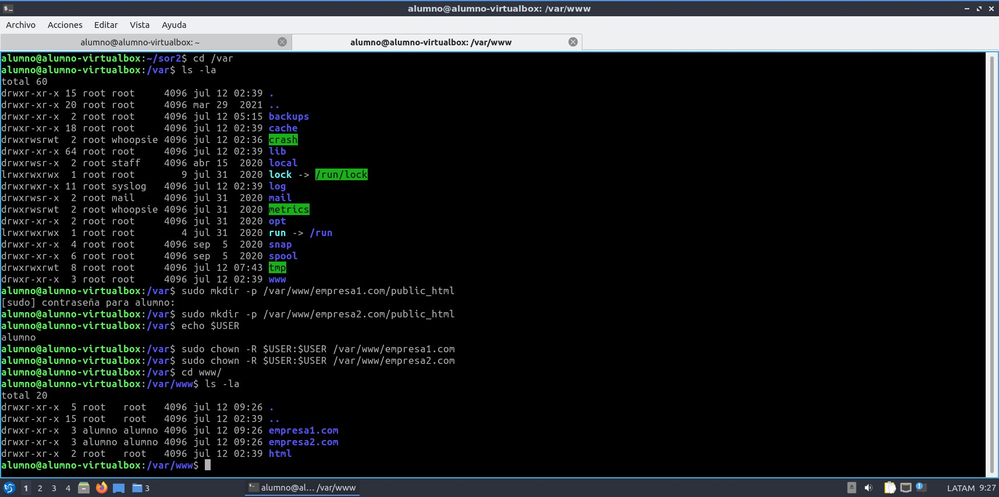

Se crearon archivos index.html para cada empresa. Cada uno en su respectivo `/var/www/empresax.com/public_html`

- Empresa 1: [index.html](capturas/3/empresa1/index.html)
- Empresa 2: [index.html](capturas/3/empresa2/index.html)


### 3.1.4 Configuración en apache de sitios virtuales

Se crearon los achivos de configuración en Apache para cada empresa

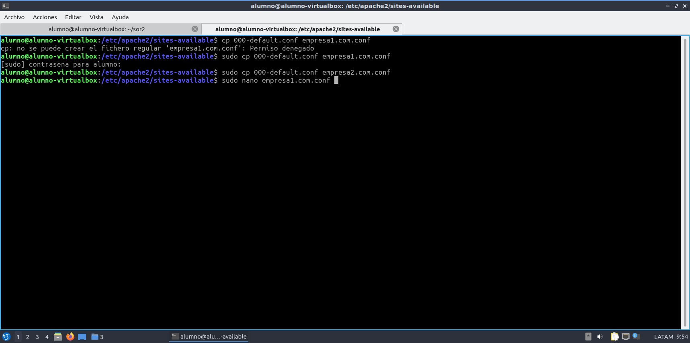

Archivos de configuración:
- Empresa 1: [empresa1.com.conf](capturas/3/empresa1/empresa1.com.conf)
- Empresa 2: [empresa2.com.conf](capturas/3/empresa2/empresa2.com.conf)

Se activaron los sitios virtuales al ejecutar en secuencia los comandos:

```bash
sudo a2ensite empresa1.com.conf
sudo a2ensite empresa2.com.conf
sudo a2dissite 000-default.conf
sudo systemctl restart apache2
```

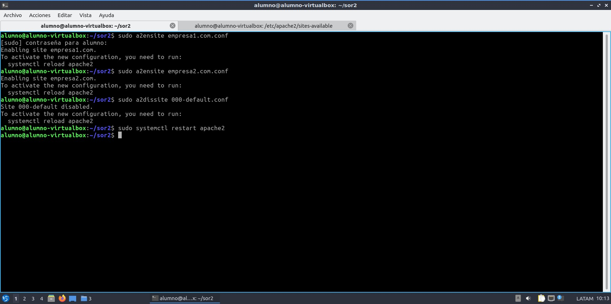


## 3.2 Segunda Parte: Instalación de MySQL y PHP

### 3.2.1 Instalación de Mysql

```bash
sudo apt-get install mysql-server -y
```

Resultado de la ejecución: [3-2-1-1.txt](capturas/3/3-2-1-1.txt)


Configuración de seguridad en mysql
```bash
sudo mysql_secure_installation
```

Resultado de la ejecución: [3-2-1-2.txt](capturas/3/3-2-1-2.txt)

### 3.2.2 Creación de base de datos y usuarios

```bash
mysql -u root -p
CREATE DATABASE dbprueba;
CREATE USER 'usuariotest'@'localhost' IDENTIFIED BY 'password';
GRANT ALL PRIVILEGES ON dbprueba.* TO 'usuariotest'@'localhost';
```

Resultado de la ejecución: [3-2-2-1.txt](capturas/3/3-2-2-1.txt)

### 3.2.3 Instalación de PHP

```bash
sudo apt-get install php libapache2-mod-php php-mysql -y
```

Resultado de la ejecución: [3-2-3-1.txt](capturas/3/3-2-3-1.txt)

### 3.2.4 Prueba de PHP

Se crea un archivo info.php dentro del vhost de empresa 1

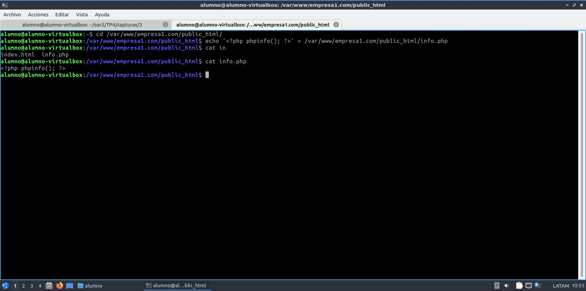

Se accede satisfactoriamente mediante el navegador web y PHP es funcional

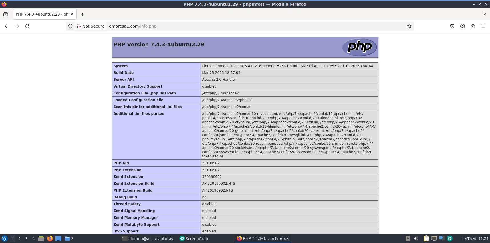


## 3.3 Tercera Parte: Instalación de un CMS (WordPress)

### 3.3.1 Descarga

Se procede a seguir las instrucciones de la [documentación oficial](https://developer.wordpress.org/advanced-administration/before-install/howto-install/) de Wordpress.

Ubicados en `/var/www/empresa2.com/public_html`

```bash
wget https://wordpress.org/latest.tar.gz
tar -xzvf latest.tar.gz
cp wordpress/* -r  # Porque queremos la instalación en la raíz 
                   # y no en la carpeta wordpress
rm -R wordpress/   # Luego borramos la carpeta                   
```

Resultado de la ejecución: [3-3-1-1.txt](capturas/3/3-3-1-1.txt)


Cambiamos el `index.html` a otro nombre para que PHP trabaje con el `index.php` de Wordpress

 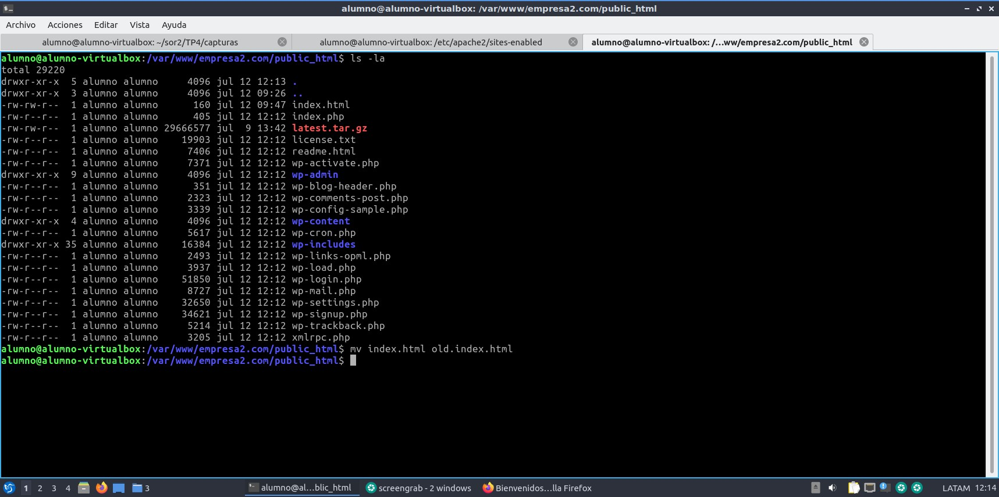


### 3.3.2 Instalalación

Ya podemos ingresar a https://empresa2.com. Lo que nos redirecciona al instalador web. Lo que significa que index.php está funcionando.
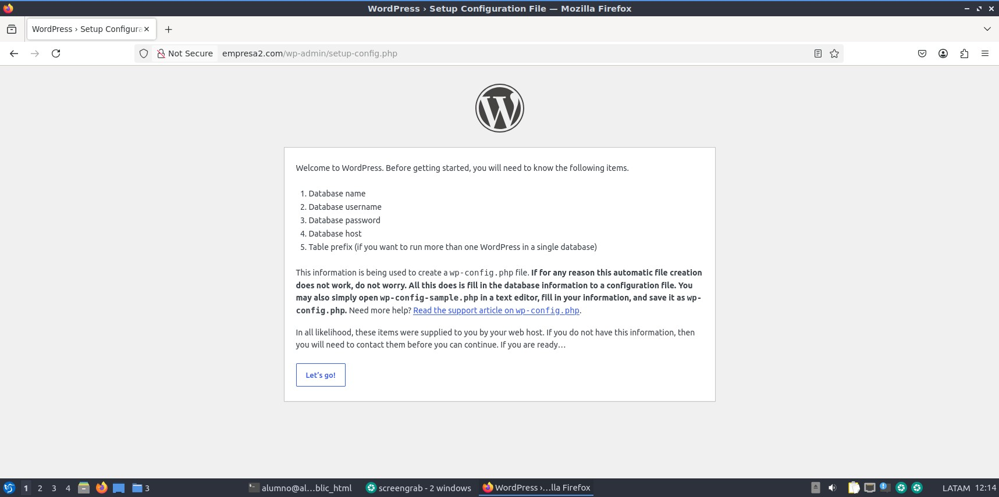

Comenzamos la instalación e ingresamos los datos de conexión a la base de datos previamente creada

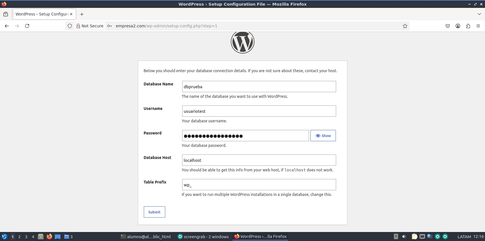

Obtenemos el contenido de `wp-config.php`

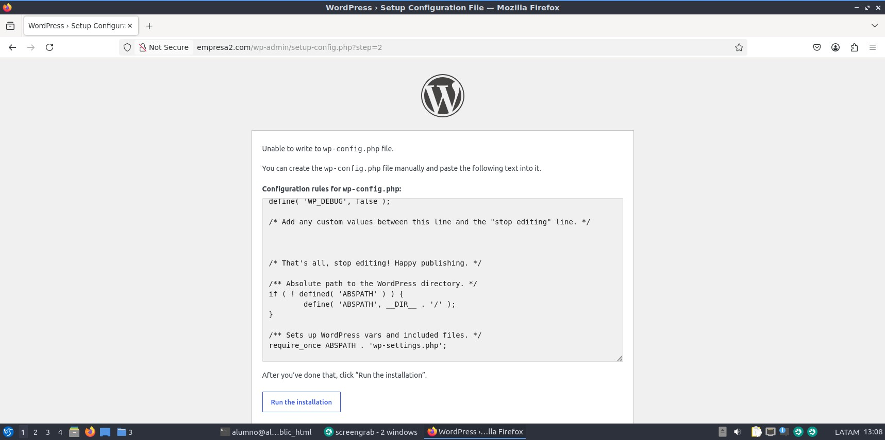

Colocamos su contenido en la raiz del virtual host de empresa2

```bash
cd /var/www/empresa2.com/public_html
touch wp-config.php
nano wp-config.php
```

Resultado de la ejecución: [3-3-2-4.txt](capturas/3/3-3-2-4.txt)

Creamos nuestro primer usuario en Wordpress

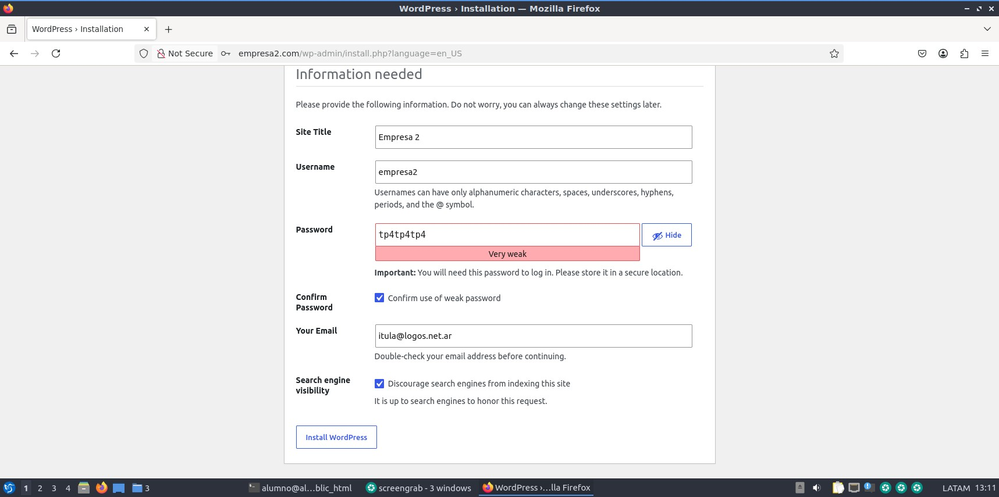

Finalizamos el asistente

 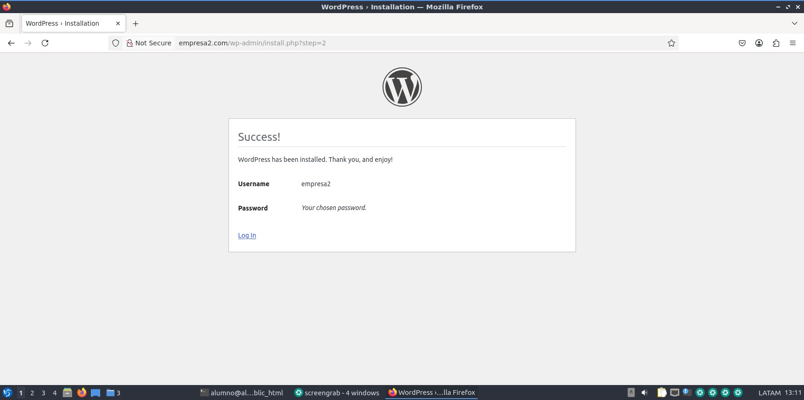

 Ya tenemos Wordpress completamente funcional

 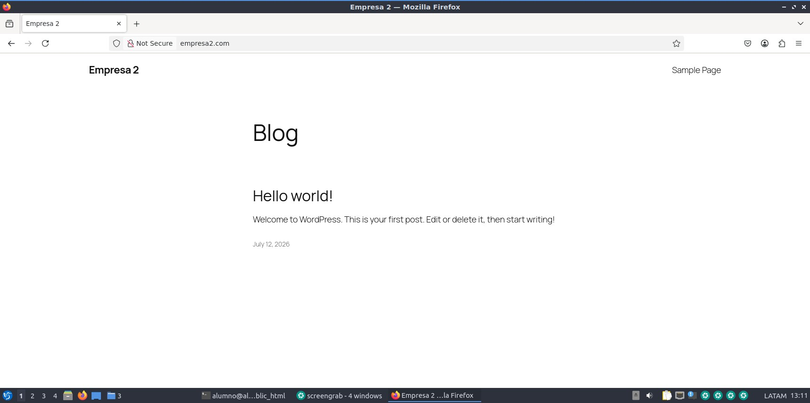


 ## 3.4 Cuarta Parte: Configuración de Certificados y Seguridad en HTTPS

 ### 3.4.1 Habilitación de módulos de Apache para SSL @todo

```bash
sudo a2enmod ssl
sudo a2enmod socache_shmcb
```
 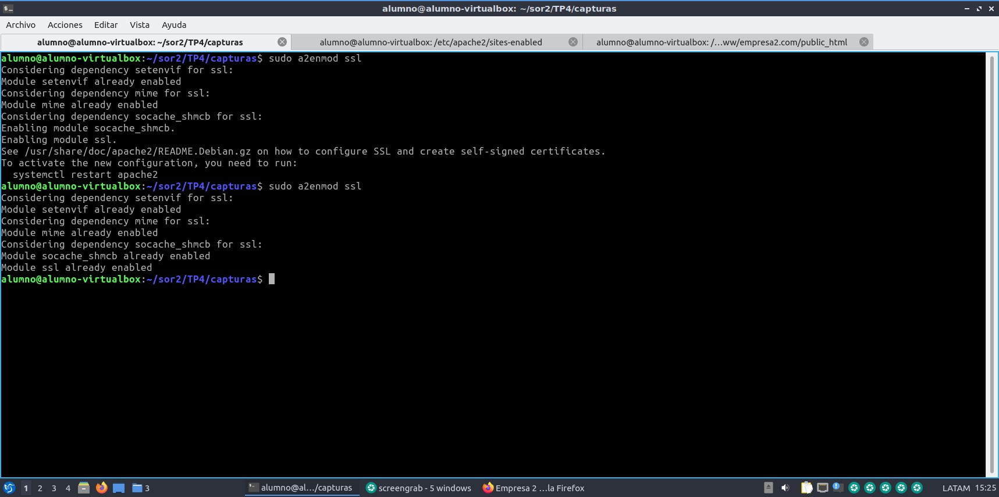


 ### 3.4.2 Creación de nuevo virtual host con SSL

Se crea la carpeta para contener el sitio web que va a usar https ejecutando:

```bash
sudo mkdir -p /var/www/secure_example/public_html
sudo chown -R $USER:$USER /var/www/secure_example/public_html
```
 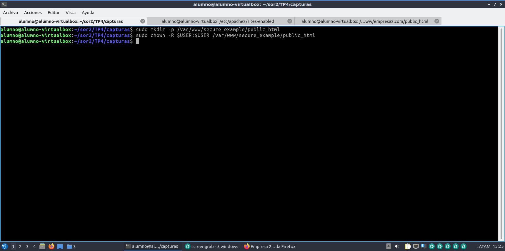

Se crea un nuevo archivo de configuración de un vhost en `/etc/apache2/sites-available/secure-site.conf`

```bash
<VirtualHost *:443>
 ServerName secure-example.com
 DocumentRoot /var/www/secure_example/public_html
 SSLEngine on
 SSLCertificateFile /etc/ssl/certs/alice_cert.pem
 SSLCertificateKeyFile /etc/ssl/private/alice.pem
 <Directory /var/www/html>
 Options Indexes FollowSymLinks
 AllowOverride All
 Require all granted
 </Directory>
 ErrorLog ${APACHE_LOG_DIR}/error.log
 CustomLog ${APACHE_LOG_DIR}/access.log combined
</VirtualHost>

```

Archivo de [secure-site.conf](capturas/3/secure-site.conf)


 Habilitamos el nuevo virtual host ejecutando:

```bash
sudo a2ensite secure-site.conf
sudo systemctl reload apache2
```


### 3.4.3 Generación de Certificado Autofirmado

Mediante openssl generamos un CRT y una key para luego usar en Apache.

```
openssl req -x509 -newkey rsa:2048 -keyout /etc/ssl/private/selfsigned.key \
-out /etc/ssl/certs/selfsigned.crt -days 365 -nodes
```

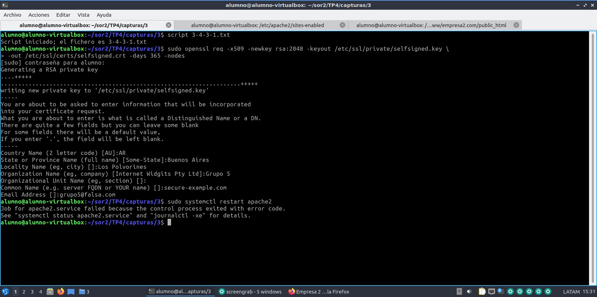

Luego agregamos las siguientes líneas, reemplazando las ya existenets en el `secure-site.conf`

```
SSLCertificateFile /etc/ssl/certs/selfsigned.crt
SSLCertificateKeyFile /etc/ssl/private/selfsigned.key
```
Resultado de la ejecución: [3-4-3-1.txt](capturas/3/3-4-3-1.txt)

### 3.4.4 Mejorando la seguridad

Aplicamos las buenas prácticas recomendadas agregando estas líneas al `secure-site.conf`

```
SSLProtocol all -SSLv3 -TLSv1 -TLSv1.1
SSLCipherSuite HIGH:!aNULL:!MD5
Header always set Strict-Transport-Security "max-age=3153600 >>>  includeSubDomains"
```

Reiniciar Apache

```bash
sudo systemctl restart apache2
```
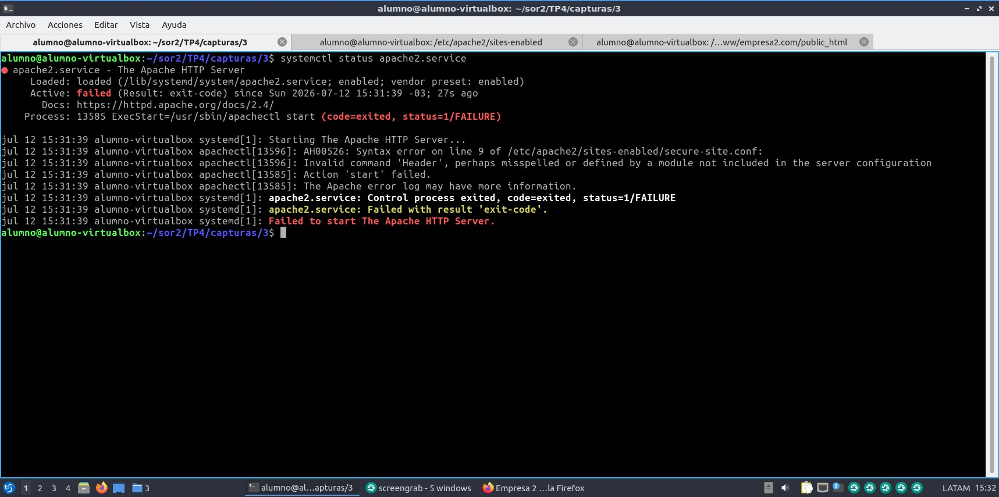

Nos topamos con un error, al observar los logs que reporta systemd, observamos que es un problema en la línea 9. Sobre el manejo de headers. Decidimos comentarla para probar todo lo demás y luego resolver esta única configuración problemática

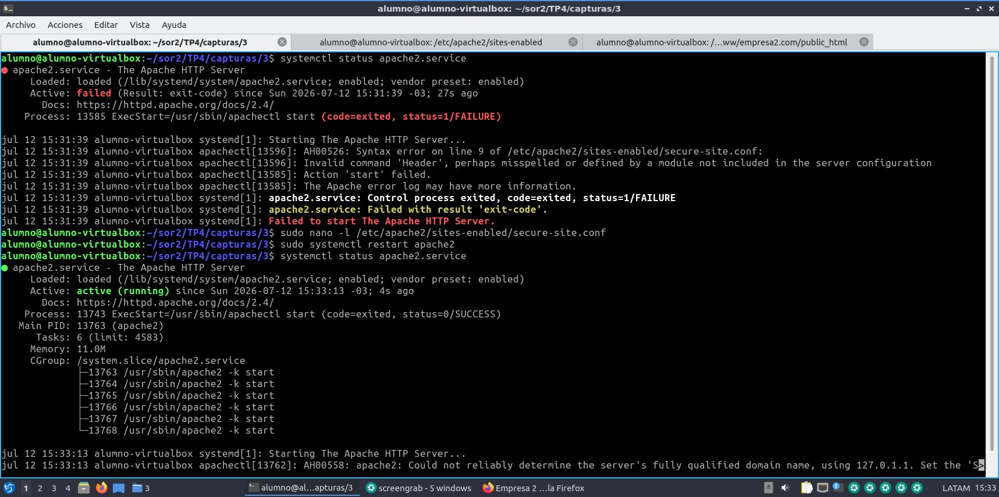


# 3.4.4 Resolución del problema con la directiva Header

Mostramos el contenido de la configuración del vhost, y notamos que no funciona. Luego habilitamos el módulo, y luego el servicio inició correctamente

```bash
cat /etc/apache2/sites-available/secure-site.conf 
sudo systemctl restart apache2
systemctl status apache2.service
sudo a2enmod headers
sudo systemctl restart apache2
```

Se resolvió la problemática habilitando el módulo Header de Apache.

Resultado de la ejecución: [3-4-4-1.txt](capturas/3/3-4-4-1.txt)

### 3.4.5 Acceso al Sitio Web

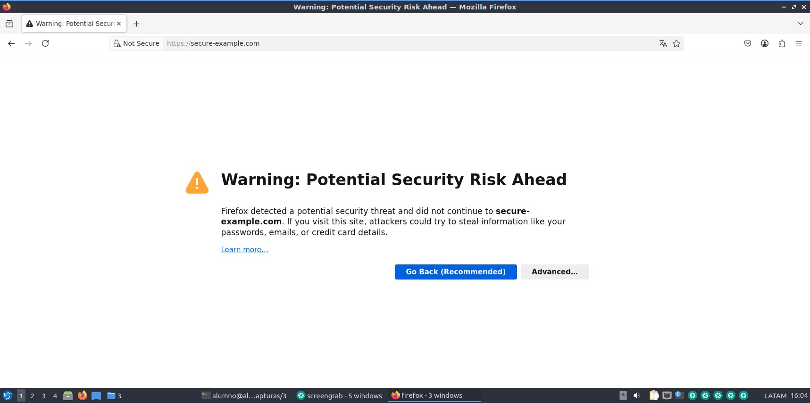

Si bien es posible acceder mediante protocolo https al sitio web, los navegadores aún indican que no es seguro (no porque la comunicación no esté encriptada), sino porque no pueden confirmar que los certificados vengan de una fuente confiable (porque los autofirmamos)

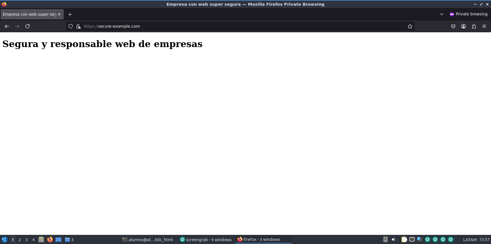

# SECCIÓN 4 - Autoridades Certificadoras y Autenticación SSL

## 4.1 Creación de una Autoridad Certificadora (CA) y Certificación de Llaves

```bash
mkdir -p CA/certs CA/private CA/newcerts
cp /etc/ssl/openssl.cnf CA/ca.conf
echo 1000 > CA/serial
touch CA/index.txt
```

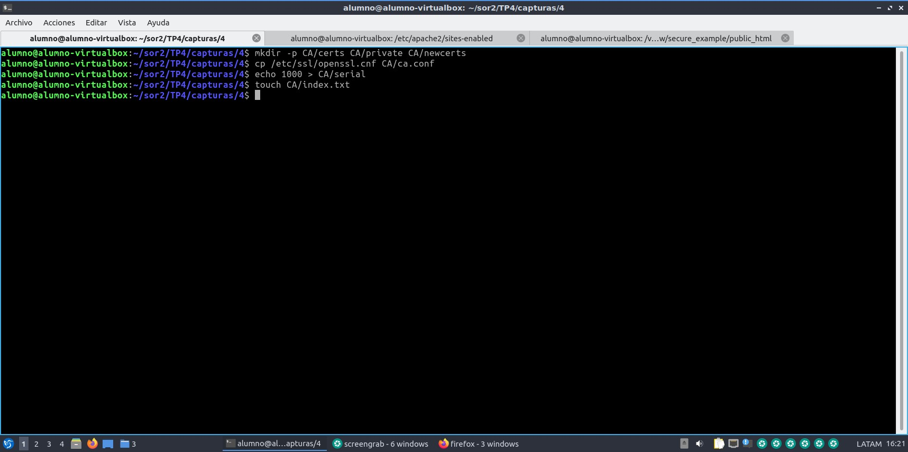


Especificamos la ruta absoluta en `ca.conf` 
Resultado de la ejecución [4-1-2.txt](capturas/4/4-1-2.txt)

Captura de `ca.conf` respecto de la `[policy_match]`

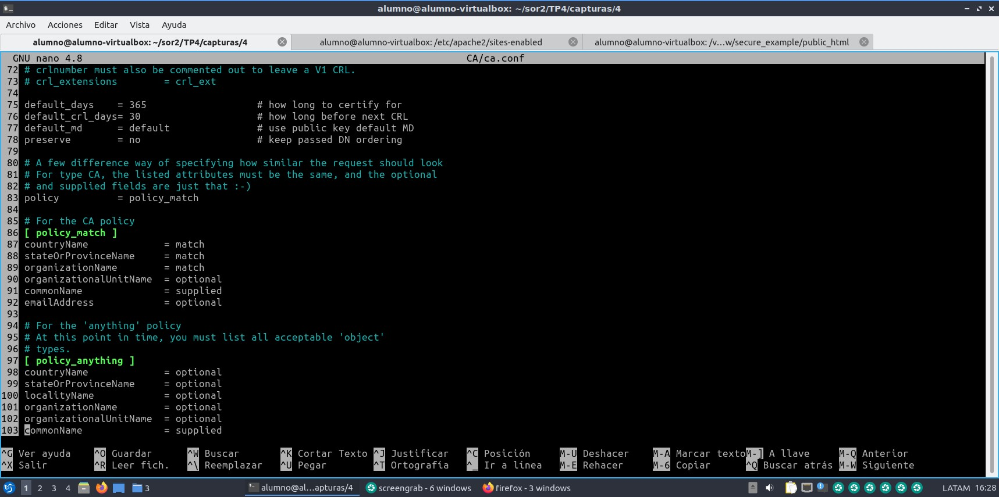

Significando que cualquier firma que realicemos con la CA, debe tener exactamente el mismo País, Estado/Provincia y Organización.
