# TP4
# PROTOCOLOS Y SEGURIDAD EN REDES 
## SOR2 2S 2026 Intensivo
## Universidad Nacional de General Sarmiento
## Licenciatura en Sistemas
## Sistemas Operativos y Redes 2 (A0533)
### Año y semestre: 
Intensivo Invierno 2026

Grupo 5
### Profesor: 
- Benjamín Chuquimango
### Integrantes: 
- David Ezequiel Cañete 
- Ignacio Mariano Tula


# Índice
@todo


# SECCIÓN 1 — Introducción

## 1.1 Contexto y objetivo del trabajo
El presente trabajo práctico tiene como objetivo principal la implementación, configuración y securización de un entorno de servidores web. A través de la virtualización, se busca comprender de manera práctica el funcionamiento del stack LAMP (Linux, Apache, MySQL, PHP), el despliegue de un CMS (WordPress) y, de manera crítica, la aplicación de protocolos de seguridad en redes. Esto incluye la configuración de conexiones seguras mediante HTTPS, la creación de una Autoridad Certificadora (CA) propia, la firma y revocación de certificados (CRL), y la autenticación de clientes frente al servidor mediante certificados SSL.

## 1.2 Distribución de tareas entre integrantes


Tabla de distribución:
|*Integrante* | *Tarea a Cargo* |
| ------------- | ------------- |
| David Cañete | Configuración inicial del entorno y redacción de Secciones 1 y 2.<br>Instalación de pila LAMP, configuración de Virtual Hosts y MySQL (Sec. 3.1 y 3.2).<br> Despliegue del CMS WordPress (Sec. 3.3).<br> Configuración del cliente web (Firefox) para autenticación PKCS12 (Sec 4.5).<br> Consolidación del informe final y revisión de formato. | 
| Ignacio Tula | Configuración de HTTPS, cifrado y módulos de seguridad en Apache (Sec. 3.4).<br>Creación y gestión de la Autoridad Certificadora (CA) local (Sec 4.1 y 4.2).<br> Generación y firma de CSR para autenticación asimétrica (Sec 4.3 y 4.4).<br> Gestión de Listas de Revocación (CRL) y endurecimiento del servidor (Sec 4.6).<br> Revisión técnica cruzada de comandos y logs del sistema. | 

## 1.3 Formato del informe
Este informe fue redactado sobre un repositorio GIT usando markdown siguiendo los lineamientos del documento `ESTRUCTURA ESTÁNDAR DEL INFORME TÉCNICO.pdf`. Y luego convertido en formato latex, para ser exportado en PDF. 

Este último formato, fue compilado desde el markdown original con asistencia de modelos del lenguaje que ayudaron a dar formato y diseño al PDF.

El enlace del repositorio, donde se encuentra el markdown con los archivos originales es:
https://gitlab.com/informatica-ungs/LS_UNGS-19-SOR2-Intensivo-Invierno-2026/-/tree/main/TP4?ref_type=heads

El repositorio completo se encuentra en:
https://gitlab.com/informatica-ungs/LS_UNGS-19-SOR2-Intensivo-Invierno-2026


# SECCIÓN 2 — Entorno de Trabajo

## 2.1 Sistema operativo (salida de uname -a y cat /etc/os-release)


## 2.2 Recursos de la VM (RAM, disco, CPU asignados)


## 2.3 Herramientas utilizadas (nombre y versión de cada herramienta relevante)

### 2.3.1 Preparación de la VM para escrbir en repo
Creamos un juego de clave privada y pública SSH para poder iniciar sesión usando dicho protocolo en el repositorio GIT del presente trabajo. 

Con la finalidad de facilitar la sincronización de los archivos de captura de pantalla o de grabación de la entrada/salida de la terminal

```bash
ssh keygen
```


### 2.3.2 Configuración de /etc/hosts
En el apartado 3 en adelante, se nos solicita crear virtual host en Apache para dominios `empresa1.com` y `empresa2.com`. Sin embargo, la resolución de nombres terminará apuntando a estos sitios en internet. Por lo tanto necesitamos forzar a la máquina virtual a que apunte dichos nombres DNS al propio `localhost`, con la finalidad de que el navegador apunte las solicitudes web a nuestro servidor Apache.


```bash
cat /etc/hosts
echo "127.0.0.1    empresa1.com" | sudo tee -a /etc/hosts
echo "127.0.0.1    empresa2.com" | sudo tee -a /etc/hosts
echo "127.0.0.1    secure-example.com" | sudo tee -a /etc/hosts
ping -c 4 empresa1.com
```

Con estos comandos, asignamos que los nombres `empresa1.com` y `empresa2.com` resuelvan a `localhost` (`127.0.0.1`), evitando que salgan a resolverse a un servidor DNS de un proveedor de internet.

Con el ping, simplemente verificamos que al preguntar por `empresa1.com` efectivamente responde nuestra propia máquina virtual local, y no un servidor remoto en internet.


# SECCIÓN 3 - Seguridad en HTTPS, Certificados y Autoridad Certificante

## 3.1 Primera Parte: Instalación de Servidor LAMP

### 3.1.1 Instalación de apache

Se instaló el servidor web Apache con
```bash
sudo apt-get install apache2 -y > archivo.txt
```

[Salida de Instalación de Apache](capturas/3/3-1-1.txt)


### 3.1.2 Configuración general de Apache

Se revisó el contenido de los archivos de configuración

- `/etc/apache/apache2.conf` 
- `/etc/apache/ports.conf`


Contenido de: [apache2.conf](capturas/3/apache2.conf)


Contenido de: [ports.conf](capturas/3/ports.conf)

### 3.1.3 Creación de carpetas web para sitios virtuales

Se ejecutaron los siguientes comandos para crear las carpetas de los virtual hosts, y asignarle permisos adecuados a nuestro usuario


Se crearon archivos index.html para cada empresa. Cada uno en su respectivo `/var/www/empresax.com/public_html`

- Empresa 1: [index.html](capturas/3/empresa1/index.html)
- Empresa 2: [index.html](capturas/3/empresa2/index.html)


### 3.1.4 Configuración en apache de sitios virtuales

Se crearon los achivos de configuración en Apache para cada empresa


Archivos de configuración:
- Empresa 1: [empresa1.com.conf](capturas/3/empresa1/empresa1.com.conf)
- Empresa 2: [empresa2.com.conf](capturas/3/empresa2/empresa2.com.conf)

Se activaron los sitios virtuales al ejecutar en secuencia los comandos:

```bash
sudo a2ensite empresa1.com.conf
sudo a2ensite empresa2.com.conf
sudo a2dissite 000-default.conf
sudo systemctl restart apache2
```


## 3.2 Segunda Parte: Instalación de MySQL y PHP

### 3.2.1 Instalación de Mysql

```bash
sudo apt-get install mysql-server -y
```

Resultado de la ejecución: [3-2-1-1.txt](capturas/3/3-2-1-1.txt)


Configuración de seguridad en mysql
```bash
sudo mysql_secure_installation
```

Resultado de la ejecución: [3-2-1-2.txt](capturas/3/3-2-1-2.txt)

### 3.2.2 Creación de base de datos y usuarios

```bash
mysql -u root -p
CREATE DATABASE dbprueba;
CREATE USER 'usuariotest'@'localhost' IDENTIFIED BY 'password';
GRANT ALL PRIVILEGES ON dbprueba.* TO 'usuariotest'@'localhost';
```

Resultado de la ejecución: [3-2-2-1.txt](capturas/3/3-2-2-1.txt)

### 3.2.3 Instalación de PHP

```bash
sudo apt-get install php libapache2-mod-php php-mysql -y
```

Resultado de la ejecución: [3-2-3-1.txt](capturas/3/3-2-3-1.txt)

### 3.2.4 Prueba de PHP

Se crea un archivo info.php dentro del vhost de empresa 1


Se accede satisfactoriamente mediante el navegador web y PHP es funcional


## 3.3 Tercera Parte: Instalación de un CMS (WordPress)

### 3.3.1 Descarga

Se procede a seguir las instrucciones de la [documentación oficial](https://developer.wordpress.org/advanced-administration/before-install/howto-install/) de Wordpress.

Ubicados en `/var/www/empresa2.com/public_html`

```bash
wget https://wordpress.org/latest.tar.gz
tar -xzvf latest.tar.gz
cp wordpress/* -r  # Porque queremos la instalación en la raíz 
                   # y no en la carpeta wordpress
rm -R wordpress/   # Luego borramos la carpeta                   
```

Resultado de la ejecución: [3-3-1-1.txt](capturas/3/3-3-1-1.txt)


Cambiamos el `index.html` a otro nombre para que PHP trabaje con el `index.php` de Wordpress

 

### 3.3.2 Instalación

Ya podemos ingresar a https://empresa2.com. Lo que nos redirecciona al instalador web. Lo que significa que index.php está funcionando.


Comenzamos la instalación e ingresamos los datos de conexión a la base de datos previamente creada


Obtenemos el contenido de `wp-config.php`


Colocamos su contenido en la raiz del virtual host de empresa2

```bash
cd /var/www/empresa2.com/public_html
touch wp-config.php
nano wp-config.php
```

Resultado de la ejecución: [3-3-2-4.txt](capturas/3/3-3-2-4.txt)

Creamos nuestro primer usuario en Wordpress


Finalizamos el asistente

 

Ya tenemos Wordpress completamente funcional

 

## 3.4 Cuarta Parte: Configuración de Certificados y Seguridad en HTTPS

### 3.4.1 Habilitación de módulos de Apache para SSL

```bash
sudo a2enmod ssl
sudo a2enmod socache_shmcb
```


### 3.4.2 Creación de nuevo virtual host con SSL

Se crea la carpeta para contener el sitio web que va a usar https ejecutando:

```bash
sudo mkdir -p /var/www/secure_example/public_html
sudo chown -R $USER:$USER /var/www/secure_example/public_html
```


Se crea un nuevo archivo de configuración de un vhost en `/etc/apache2/sites-available/secure-site.conf`

```bash
<VirtualHost *:443>
 ServerName secure-example.com
 DocumentRoot /var/www/secure_example/public_html
 SSLEngine on
 SSLCertificateFile /etc/ssl/certs/alice_cert.pem
 SSLCertificateKeyFile /etc/ssl/private/alice.pem
 <Directory /var/www/html>
 Options Indexes FollowSymLinks
 AllowOverride All
 Require all granted
 </Directory>
 ErrorLog ${APACHE_LOG_DIR}/error.log
 CustomLog ${APACHE_LOG_DIR}/access.log combined
</VirtualHost>
```

Archivo de [secure-site.conf](capturas/3/secure-site.conf)


Habilitamos el nuevo virtual host ejecutando:


```bash
sudo a2ensite secure-site.conf
sudo systemctl reload apache2
```


### 3.4.3 Generación de Certificado Autofirmado

Mediante openssl generamos un CRT y una key para luego usar en Apache.

```bash
openssl req -x509 -newkey rsa:2048 -keyout /etc/ssl/private/selfsigned.key \
-out /etc/ssl/certs/selfsigned.crt -days 365 -nodes
```


Luego agregamos las siguientes líneas, reemplazando las ya existenets en el `secure-site.conf`

```bash
SSLCertificateFile /etc/ssl/certs/selfsigned.crt
SSLCertificateKeyFile /etc/ssl/private/selfsigned.key
```
Resultado de la ejecución: [3-4-3-1.txt](capturas/3/3-4-3-1.txt)

### 3.4.4 Mejorando la seguridad

Aplicamos las buenas prácticas recomendadas agregando estas líneas al `secure-site.conf`

```bash
SSLProtocol all -SSLv3 -TLSv1 -TLSv1.1
SSLCipherSuite HIGH:!aNULL:!MD5
Header always set Strict-Transport-Security "max-age=3153600 >>>  includeSubDomains"
```

Reiniciar Apache

```bash
sudo systemctl restart apache2
```


Nos topamos con un error, al observar los logs que reporta systemd, observamos que es un problema en la línea 9. Sobre el manejo de headers. Decidimos comentarla para probar todo lo demás y luego resolver esta única configuración problemática


# 3.4.4 Resolución del problema con la directiva Header

Mostramos el contenido de la configuración del vhost, y notamos que no funciona. Luego habilitamos el módulo, y luego el servicio inició correctamente

```bash
cat /etc/apache2/sites-available/secure-site.conf 
sudo systemctl restart apache2
systemctl status apache2.service
sudo a2enmod headers
sudo systemctl restart apache2
```

Se resolvió la problemática habilitando el módulo Header de Apache.

Resultado de la ejecución: [3-4-4-1.txt](capturas/3/3-4-4-1.txt)

### 3.4.5 Acceso al Sitio Web


Si bien es posible acceder mediante protocolo https al sitio web, los navegadores aún indican que no es seguro (no porque la comunicación no esté encriptada), sino porque no pueden confirmar que los certificados vengan de una fuente confiable (porque los autofirmamos)


# SECCIÓN 4 - Autoridades Certificadoras y Autenticación SSL

## 4.1 Creación de una Autoridad Certificadora (CA) y Certificación de Llaves

```bash
mkdir -p CA/certs CA/private CA/newcerts
cp /etc/ssl/openssl.cnf CA/ca.conf
echo 1000 > CA/serial
touch CA/index.txt
```


Especificamos la ruta absoluta en `ca.conf` 
Resultado de la ejecución [4-1-2.txt](capturas/4/4-1-2.txt)

Captura de `ca.conf` respecto de la `[policy_match]`


Significando que cualquier firma que realicemos con la CA, debe tener exactamente el mismo País, Estado/Provincia y Organización.

Se asignan los permisos adecuados al directorio `private`

```bash
chmod 700 CA/private
```

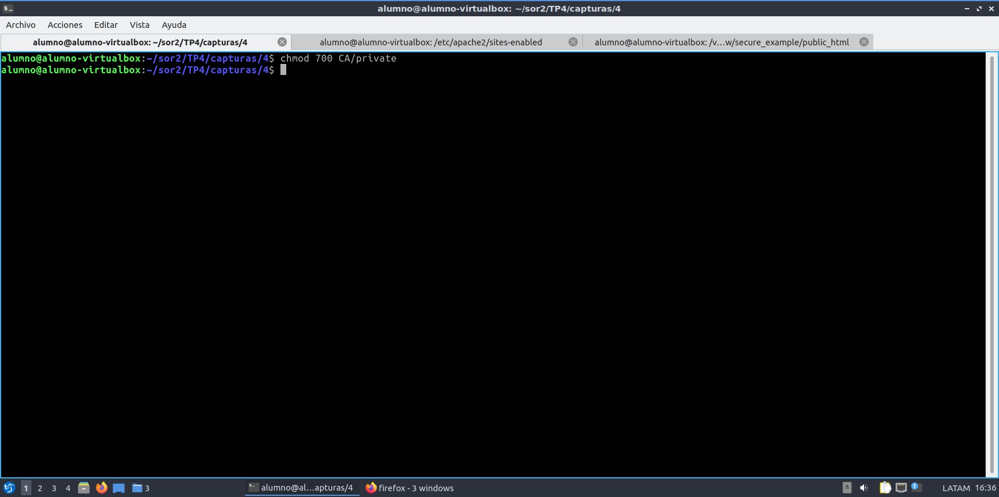

## 4.2 Creación de CA

### 4.2.1 Autofirmado

```bash
openssl req -new -x509 -days 3650 -extensions v3_ca \
-keyout CA/private/c \
-config CA/ca.conf
```

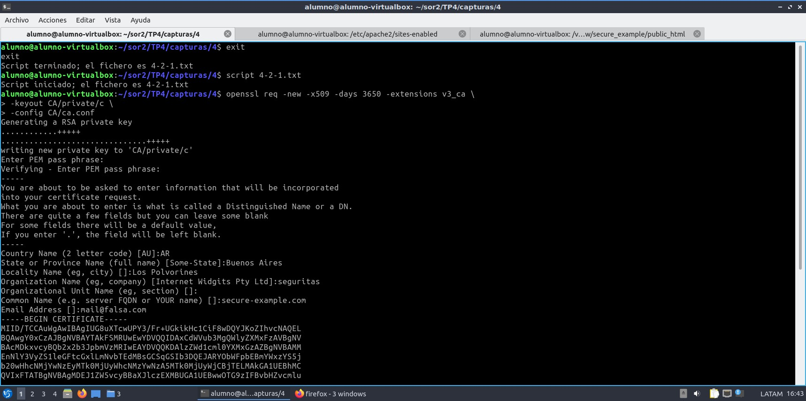

Resultado de la ejecución [4-2-1.txt](capturas/4/4-2-1.txt)

### 4.2.2 Análisis del certificado

```bash
openssl x509 -in CA/cacert.pem -noout -text
```
Se puede observar que es un certificado autofirmado porque el campo `Issuer` son exactamente iguales a los datos del campo `Subject`

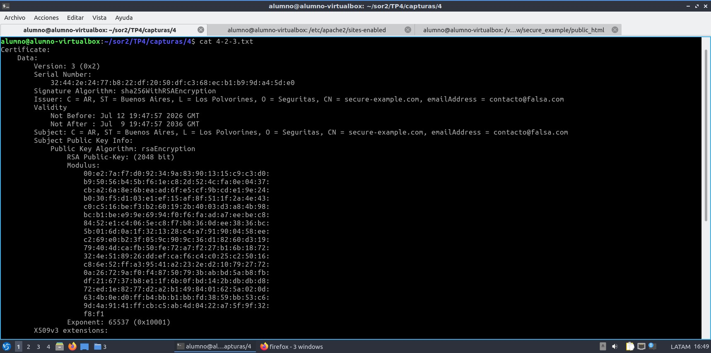

Resultado de la ejecución [4-2-3.txt](capturas/4/4-2-3.txt)

### 4.2.3 Archivos creados

`CA/private/cakey.pem:`

Es la llave privada de la Autoridad Certificadora. Como su nombre indica y al estar en la carpeta private, es el archivo más secreto. Sirve para firmar todos los futuros certificados.

`CA/cacert.pem:`

Es el certificado público (autofirmado) de la CA. Este archivo es público y es el que los navegadores usarán para confiar en los certificados que firme la CA.

## 4.3 Firma de una Solicitud de Certificado

Vamos a simular todo dentro de la misma máquina virtual para simplificar.

```bash
mkdir llaves
cd llaves
openssl genpkey -algorithm RSA -out carol-key.pem
openssl req -new -key carol-key.pem -out carol-req.pem
```

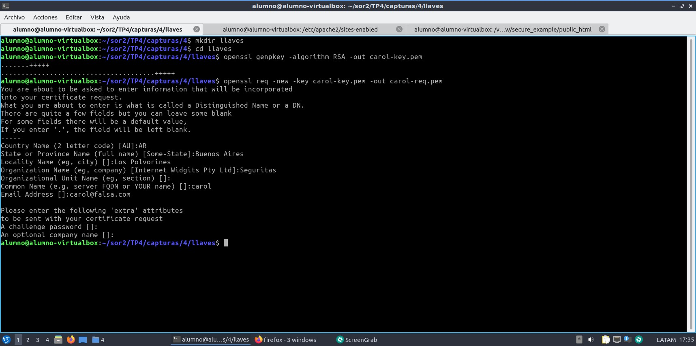

Desde la entidad certificadora ejecutamos

```bash
cp carol-req.pem ../
cd ..
openssl ca -config CA/ca.conf -out carol-cert.pem -infiles carol-req.pem
```

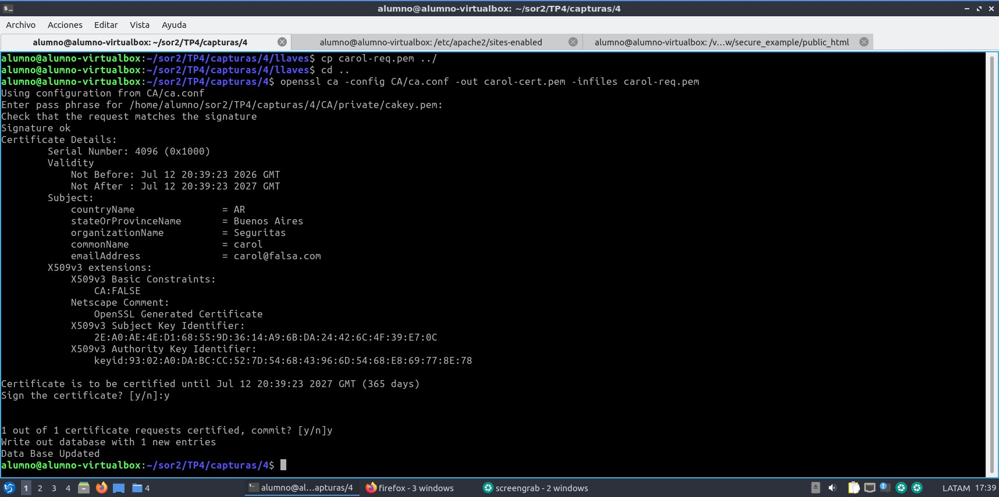

En estos últimos dos pasos, hemos representado a una usuaria, de nombre "Carol". Y hemos creado su llave privada y su solicitud. 

Luego, en el servidor, hemos "recibido" la solicitud de Carol, y la hemos firmado.

### 4.4 reflexiones sobre la firma
El certificado de Carol se almacena en dos lugares. Una copia se la entregamos a Carol (llaves/carol-cert.pem) y la CA guardó automáticamente una copia de respaldo en su base de datos, en la carpeta CA/newcerts/1000.pem. Además, se registró en el archivo CA/index.txt

La llave privada (carol-key.pem) siempre se quedó en la carpeta de Carol (llaves/). La Autoridad Certificadora nunca vio ni debe ver la llave privada del cliente. Este es el principio básico de la criptografía asimétrica.

Para ver la identidad del CA, explorando el certificado de Carol, ejecutando
```bash
 openssl x509 -in llaves/carol-cert.pem -noout -text 
```

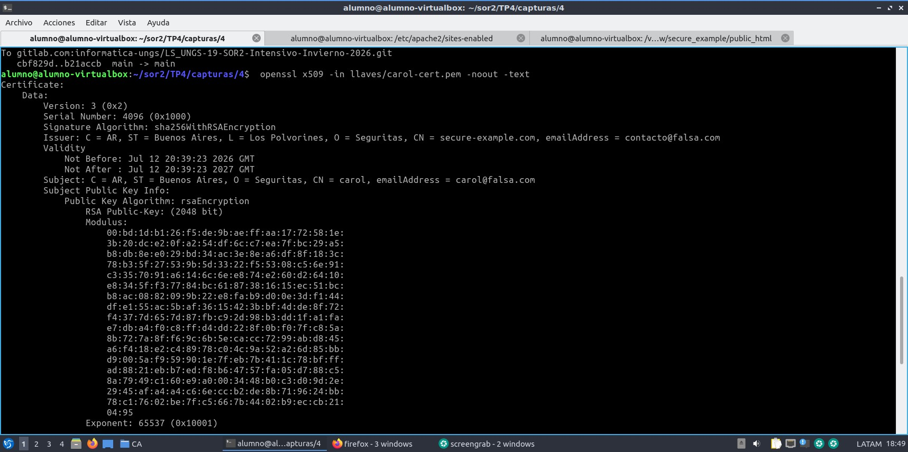

Se puede observa la identidad de la CA en el campo `Issuer`: (Emisor). 
Mientras que el campo `Subject` corresponde a Carol.

## 4.5 Autenticación de Clientes en Apache con SSL

### 4.5.1 En el servidor

Configuramos en Apache el archivo `default-ssl.conf`
Donde agregamos la línea que nos indican, pero también notamos que en ningún momento indicamos el path de la CA. Configuramos utilizando con el path creado al principio de esta misma sección.


```
SSLCACertificateFile /home/alumno/sor2/TP4/capturas/4/CA/cacert.pem
SSLVerifyClient require
```

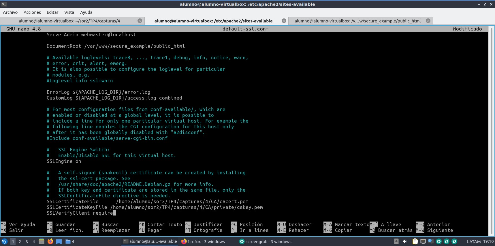

Reiniciamos Apache
```bash
sudo systemctl restart apache2
```

### 4.5.2 En el cliente

Convertimos la clave a formato PKCS12
```bash
openssl pkcs12 -export -in carol-cert.pem -inkey carol-key.pem -out carol.p12
```

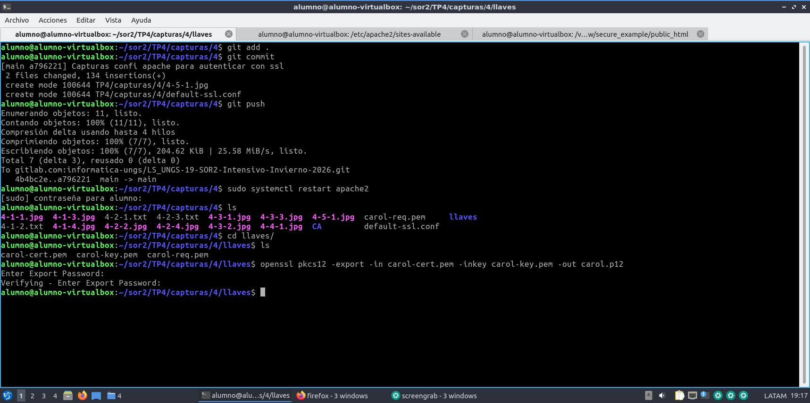

Abrimos Firefox, y nos dirigimos a la configuración. En el apartado de Privacidad y Seguridad, vamos a la sección de Certificados.

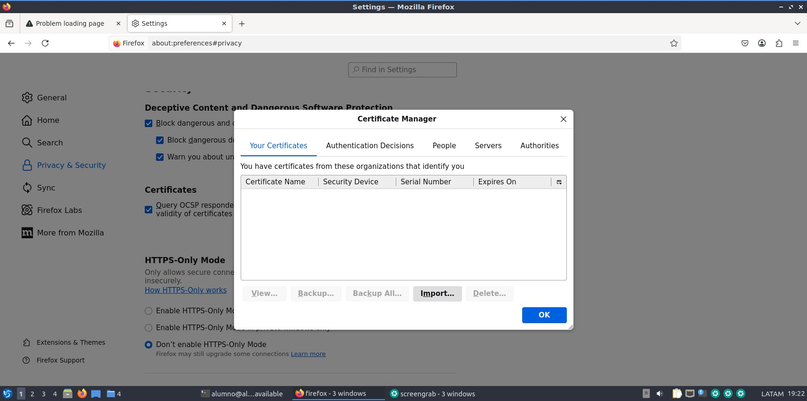

En mis certificados, elegimos importar y luego elegimos el archivo p12 que creamos recientemente

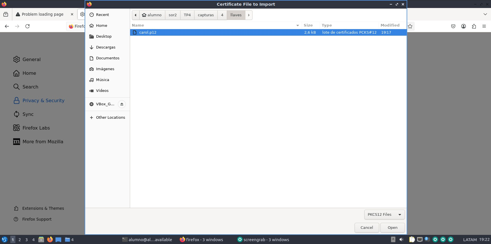

Este es un ejemplo, del mensaje de error si se intenta abrir el sitio, sin ningún certificado importado

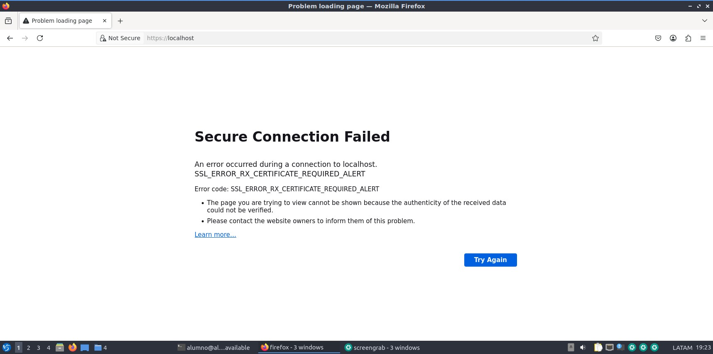

Por el contrario, al abrir el sitio web con los certificados cargados. Pregunta por cuál usar.

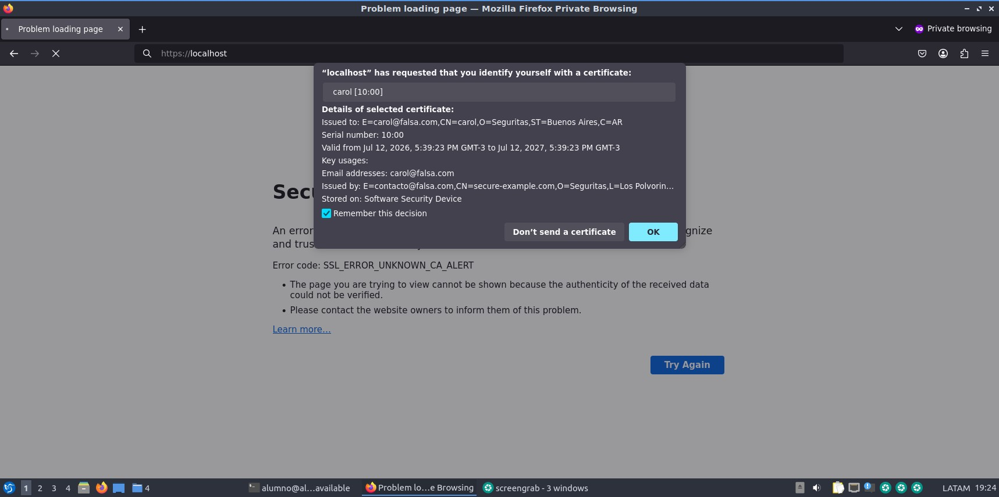

Y luego se puede acceder

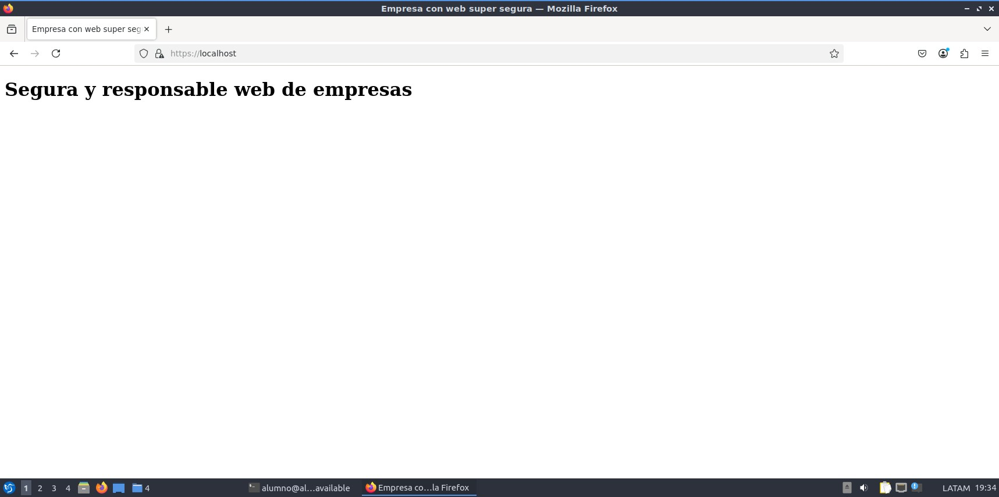

## 4.6 Revocación de certificados

### 4.6.1 Creación de una CRL

```bash
mkdir CA/crl
echo 1000 > CA/crlnumber
openssl ca -config CA/ca.conf -gencrl -out CA/crl.pem
```

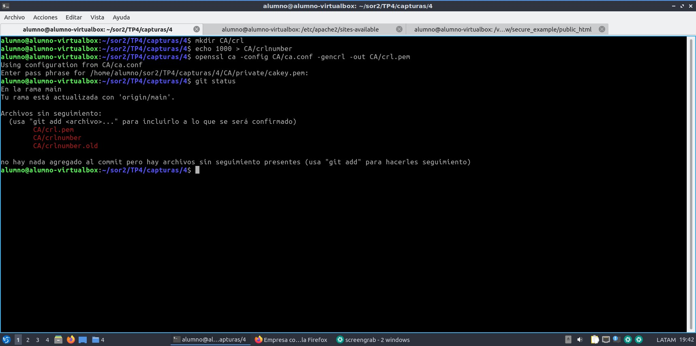

Aquí notamos que fue necesario ingresar la clave privada porque al firmar con la misma, cualquier cliente o servidor puede usar el certificado público de la CA (cacert.pem) para verificar matemáticamente que la lista de revocación fue emitida por la autoridad legítima y no ha sido alterada.

Si la CRL no estuviera firmada, un atacante podría crear una CRL falsa y revocar certificados válidos o permitir certificados comprometidos.


### 4.6.2 Análisis de la CRL

Ejecutamos

```bash
openssl crl -in CA/crl.pem -noout -text
```

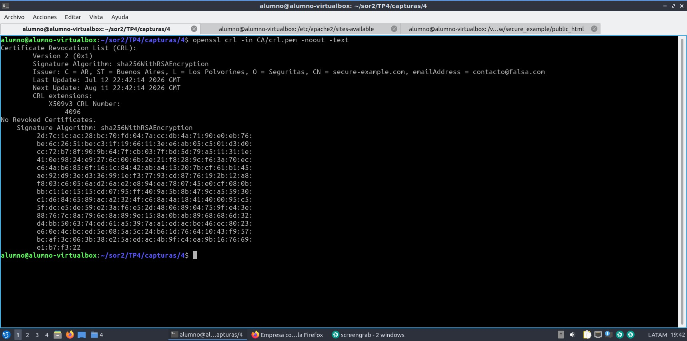

Observamos los siguientes campos
`Issuer`: Datos de la CA (País, Estado, Organización). Es decir quien emite la lista.

`Last Update / Next Update`: Muestra cuándo se generó esta lista y cuándo expira.

`Revoked Certificates`: Como esta es la CRL Inicial, todavía no hay certificados revocados.

### 4.6.3 Revocación

Vamos a revocar el certificado de Carol con

```bash
openssl ca -config CA/ca.conf -revoke CA/newcerts/1000.pem
```

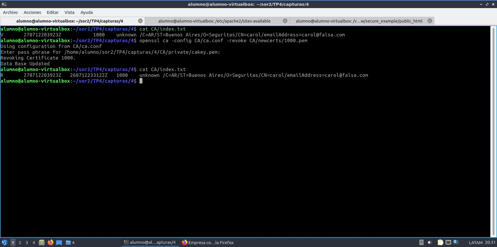

Observamos que el `index.txt` ahora indica una `R` (de revocado) en la entrada de Carol


Al analizar nuevamente crl.pem con

```bash
openssl crl -in CA/crl.pem -noout -text
```

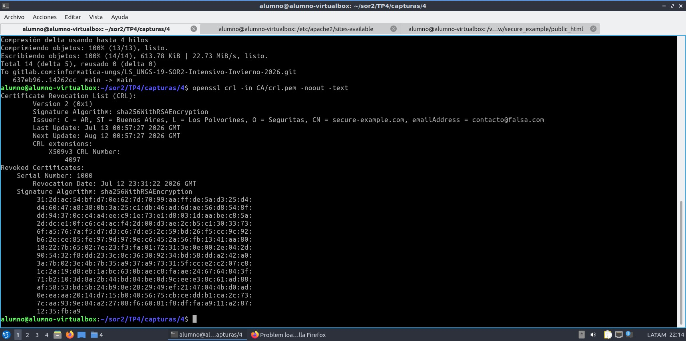

Observamos ahora que hay contenido en `Revoked Certificates`

### 4.6.4 Publicación de una CRL Actualizada

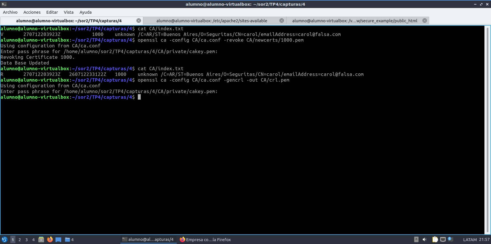

### 4.6.5 Revisión de CRL

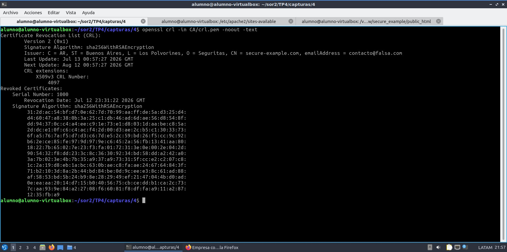

### 4.6.6 Configuración de Apache con CRL
Agregamos en los virtual hosts las directivas `SSLCARevocationFile` y `SSLCARevocationCheck`

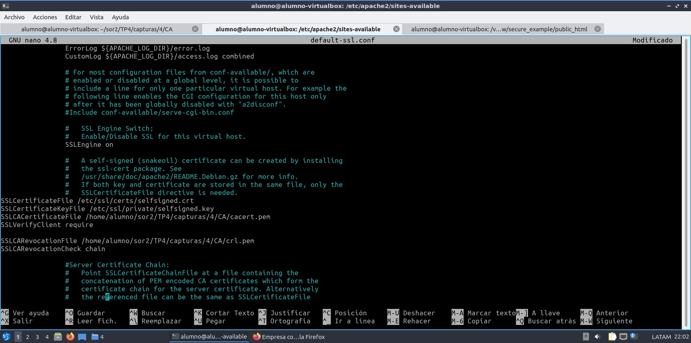

Entonces luego, al volver a entra con el navegador, obtenemos el siguiente mensaje de error

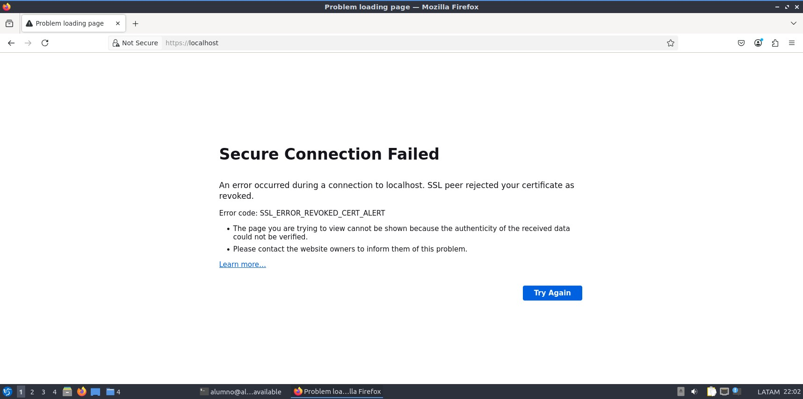


# SECCIÓN 5 — Conclusiones y Reflexión Grupal

## 5.1 Dificultades técnicas encontradas y resolución

Durante la implementación práctica en nuestras máquinas virtuales, nos enfrentamos a algunos obstáculos técnicos que resolvimos.

### Fallo en el reinicio de Apache por HSTS (Directiva Header)
Al aplicar las buenas prácticas de seguridad (apartado 3.4.4) agregando la directiva `Strict-Transport-Security`, el servidor Apache falló al reiniciar. Analizando los logs provistos por `systemctl status apache2.service`, descubrimos que el sistema no reconocía el comando `Header`. 

La resolución consistió en aislar el problema comentando la línea, y posteriormente habilitar el módulo requerido mediante sudo a2enmod headers, lo que solucionó el inconveniente definitivamente.


### Contexto de resolución DNS local 

Dado que trabajamos con dominios ficticios (empresa1.com, empresa2.com), los navegadores intentaban resolverlos en servidores DNS públicos de internet. 

Resolvimos esto interviniendo el archivo /etc/hosts de la máquina virtual para forzar la resolución al entorno localhost (127.0.0.1), aislando el entorno de pruebas.

### Rutas absolutas en la configuración de la Autoridad Certificadora

Durante la configuración de autenticación de clientes (apartado 4.5.1), notamos que la directiva SSLCACertificateFile fallaba si no se le especificaba la ruta absoluta correcta. 

Tuvimos que mapear minuciosamente la ruta `/home/alumno/sor2/TP4/capturas/4/CA/cacert.pem` para garantizar que Apache encontrara el certificado raíz.

## 5.2 Aspectos más relevantes para un entorno profesional real

Analizando las prácticas realizadas, consideramos que los siguientes puntos son críticos y directamente aplicables al mundo profesional:

- No solo aprendimos a emitir certificados, sino a revocarlos (CRL). 

En el entorno corporativo, saber dar de baja un certificado comprometido (por despido de un empleado, robo de una notebook, o vulneración de llaves).

- Autenticación Mutua (mTLS / SSL de cliente)

La configuración realizada en el apartado 4.5 simula exactamente cómo se aseguran los accesos en arquitecturas Zero Trust, intranets corporativas altamente sensibles o integraciones B2B (comunicación Server-to-Server mediante APIs).

- Hardening (Endurecimiento) del servidor web
La deshabilitación de protocolos obsoletos (-SSLv3, -TLSv1, -TLSv1.1), forzar Cipher Suites seguros e implementar HSTS.

## 5.3 Limitaciones en el alcance

Si bien el entorno es funcional y seguro matemáticamente, presenta las siguientes limitaciones respecto a una infraestructura de producción real debido a los alcances lógicos del laboratorio


Utilizamos una CA propia y certificados autofirmados. En producción, la identidad del servidor debería ser validada por una CA pública y comercial (como Let's Encrypt, DigiCert, GlobalSign) para que los navegadores web del usuario final confíen en el sitio automáticamente, sin lanzar advertencias de seguridad.


Uso de CRL estáticas vs OCSP: Implementamos listas de revocación (CRL) que, por naturaleza, son archivos estáticos que deben actualizarse y distribuirse periódicamente. En arquitecturas modernas se suele priorizar OCSP (Online Certificate Status Protocol) u OCSP Stapling, que permite consultar en tiempo real el estado de revocación de un certificado.

Todo en un único nodo (Falta de segregación y Alta Disponibilidad): Desplegamos la base de datos (MySQL), el servidor web (Apache) y la Autoridad Certificadora en la misma máquina virtual. 

La CA Raíz debería estar aislada y preferentemente offline (apagada y desconectada de la red), emitiendo certificados intermedios para firmar los de los clientes, previniendo así un robo catastrófico de la llave privada maestra.

Resolución DNS Simulada: En lugar de desplegar un servidor DNS local (como BIND9 o CoreDNS), optamos por sobreescribir /etc/hosts. En un entorno real se gestionan Zonas DNS propiamente dichas.